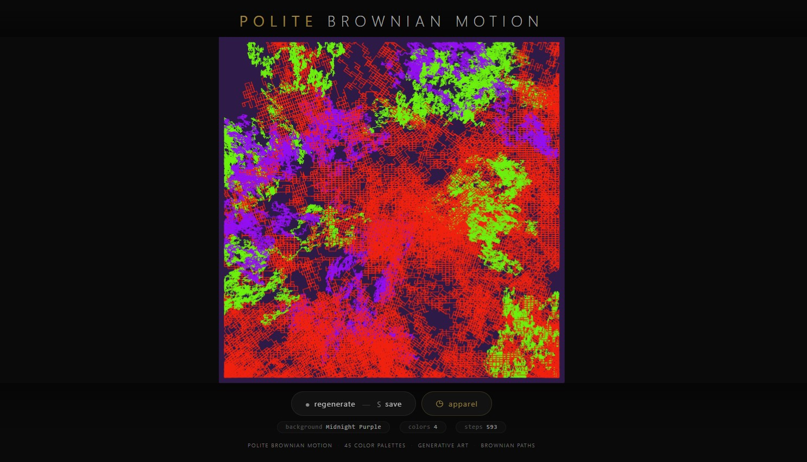
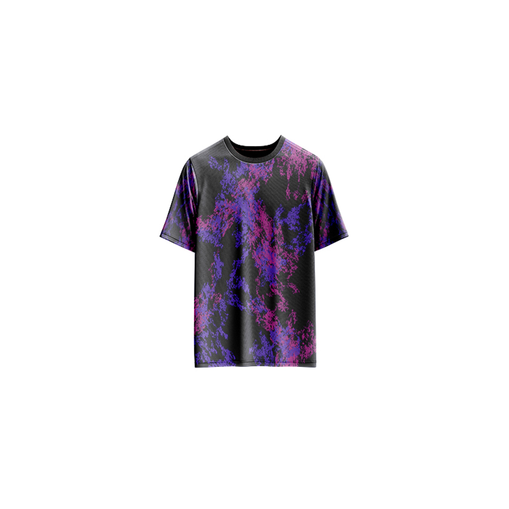

# Polite Brownian Motion — Generative Art

[](https://reyrove.github.io/Polite-Brownian-Motion-Generative-Art)
[](https://opensource.org/licenses/MIT)

> **Generative Brownian motion art with 45 vibrant color palettes.** Each refresh creates a unique composition of polite, wandering paths across a dark canvas, resembling particles drifting through space.

## 🎨 Live Demo

<div align="center">
  <a href="https://reyrove.github.io/Polite-Brownian-Motion-Generative-Art" target="_blank">
    
  </a>
  <br><br>
  <a href="https://reyrove.github.io/Polite-Brownian-Motion-Generative-Art" target="_blank">
    
  </a>
  <br>
  <em>Click the image or button to experience the generative art</em>
</div>

## 👕 Apparel Preview

<div align="center">
  
  <br>
  <em>Polite Brownian Motion artwork printed on a T-shirt</em>
</div>

## ✨ Features

- **Brownian Motion Paths** — Thousands of wandering lines create organic patterns
- **45 Color Palettes** — Unique multi-color combinations
- **27 Background Colors** — Dark and moody backgrounds
- **Variable Path Length** — 202–700 steps per color
- **Glow Effects** — Subtle shadows create a luminous quality
- **Save & Share** — Download as PNG
- **Apparel Mode** — Preview artwork on a T-shirt mockup
- **Responsive** — Works on desktop, tablet, and mobile
- **Pure JavaScript** — Built without external libraries
- **Keyboard Shortcuts**:
  - `R` — Regenerate
  - `S` — Save image
  - `T` — Toggle apparel view
  - `Space` — Regenerate

## 🎨 Artwork Details

| Parameter | Range | Description |
|-----------|-------|-------------|
| **Color Palettes** | 45 options | Multi-color combinations |
| **Background Colors** | 27 options | Dark, moody backgrounds |
| **Max Steps** | 202–700 | Total steps per color |
| **Path Layers** | Multiple | Rotating angle layers |
| **Path Length** | 10,000+ | Points per color path |
| **Grid Margin** | Variable | Edge avoidance margin |

## 🎯 Color Palettes

The artwork features 45 unique color palettes including:

| Palette Type | Example Colors |
|--------------|----------------|
| **Neon Duos** | Green + Purple, Cyan + Red |
| **Tri-color** | Cyan + Purple + Red, Pink + Yellow + Orange |
| **Quad-color** | Blue + Pink + Orange + Green |
| **Pastel** | Rose + Pink + Cream |
| **Vibrant** | Magenta + Cyan + Gold |
| **Dark** | Navy + Maroon + Teal |

### Background Colors
27 dark, rich backgrounds including:
- Black, Charcoal, Night Blue
- Deep Teal, Bottle Green
- DarkRed, Midnight Purple
- And more moody tones

## 🚀 Quick Start

### Local Development

```bash
# Clone the repository
git clone https://github.com/reyrove/Polite-Brownian-Motion-Generative-Art.git

# Navigate to the directory
cd Polite-Brownian-Motion-Generative-Art

# Open in browser
open index.html
# or use a live server
```

### Deploy to GitHub Pages

1. Push to GitHub
2. Go to Settings → Pages
3. Select branch `main` and root folder
4. Your site will be live at `https://reyrove.github.io/Polite-Brownian-Motion-Generative-Art`

## 🧠 How It Works

The artwork simulates Brownian motion - the random movement of particles suspended in a fluid:

1. **Setup**:
   - Random background color from 27 options
   - Random color palette from 45 options (2-8 colors)
   - Random maximum steps (202-700)

2. **Path Generation**:
   - Each color creates multiple paths
   - Paths move in 4 directions (up, down, left, right)
   - Rotation angles create layered, organic patterns
   - Each path consists of 10,000+ steps

3. **Rendering**:
   - Each point connects to the next with a line
   - Glow effect (shadow blur) creates luminous trails
   - Colors shift subtly across paths
   - Multiple rotation layers add depth

## 📁 File Structure

```
Polite-Brownian-Motion-Generative-Art/
├── index.html          # Main application (all-in-one)
├── Polite-Brownian-Motion.jpg # T-shirt mockup image
├── fav.svg             # Favicon
├── demo-screenshot.jpg # Website demo screenshot
├── README.md           # This file
└── LICENSE             # MIT License
```

## 🛠️ Tech Stack

- **Pure JavaScript** — No external libraries
- **Canvas API** — 2D rendering with glow effects
- **CSS Flexbox/Grid** — Responsive layout
- **GitHub Pages** — Hosting

## 🎯 Interactive Controls

| Action | Keyboard | Button |
|--------|----------|--------|
| Regenerate | `R` or `Space` | Click "regenerate" |
| Save Image | `S` | Click "regenerate" |
| Toggle Apparel | `T` | Click "apparel" |

## 🎨 The Creative Process

### Brownian Motion Simulation
The artwork simulates Brownian motion - the random movement of particles. Each path follows a random walk with directional changes, creating organic, fluid patterns that resemble particles drifting through space.

### Multi-Layer Approach
Multiple rotation angles (θ) create layered patterns. Each layer rotates the movement directions, producing complex, intertwined paths that build depth and visual interest.

### Color Harmony
45 carefully curated color palettes ensure visual harmony. Each palette contains 2-8 colors that work together, creating everything from subtle gradients to vibrant contrasts.

### Glow Effect
A subtle shadow blur creates a luminous quality, making the paths appear to glow against the dark backgrounds. This adds a sense of depth and energy to the artwork.

## 📱 Responsive Design

The application automatically adapts to:
- Desktop screens
- Tablets
- Mobile phones
- Landscape orientation
- Various aspect ratios
- Small screens (down to 380px wide)

## 🤝 Contributing

Contributions are welcome! Feel free to:
- Fork the repository
- Create a feature branch
- Submit a pull request

### Ideas for Contributions:
- Additional color palettes
- New movement patterns
- Animation features
- Interactive controls
- Performance optimizations
- More apparel mockups

## 📄 License

MIT License — see [LICENSE](LICENSE) file for details.

## 🙏 Acknowledgments

- Inspired by Brownian motion and particle physics
- Named for the polite, wandering nature of the paths
- Special thanks to the creative coding community

---

**Built with ❤️ and particle dreams**